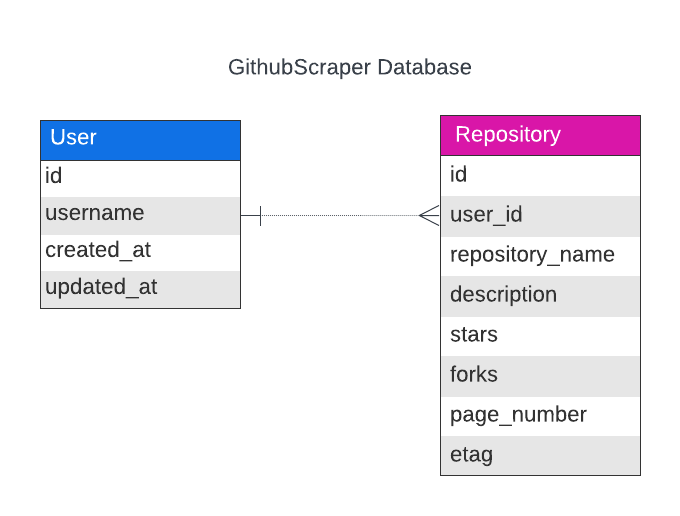

# Github Scraping Project

A full-stack project to get and store github repositories data in database and provide an appealing UI to display the data.


## 1. Installation

First clone the repository to your local machine. It has two directories: backend, and client.

```bash
# Database Setup: 
  # Make sure you have postgresql installed on your machine
  # Use a postgresql client (or a UI like PgAdmin) to create database: GithubScraper
```

```bash
# Backend Setup: 
  # Make sure you have postgresql, poetry (dependency management) on your machine.
  # Once you clone the repository:
  cd backend
  poetry install
  poetry shell

  # Create a .env file for database credentials and github API key (create a Github Personal Access Token )
  # .env file should have: DB_NAME, DB_HOST, DB_USER, DB_PASSWORD, DB_PORT, GITHUB_API_TOKEN
  # Check .env.sample file

  python manage.py makemigrations
  python manage.py migrate

  python manage.py runserver
```

```bash
# Frontend Setup: 
  # Make sure you have node, npm installed on your machine.
  cd client
  npm install
  npm start

```

## 2. Description
The project aims to collect public github repositories of users and provide an intuitive UI to display required data. The project uses Github API to provide up-to-date information about users repositories.


## 3. Features
1. User repositories page: Search for a Github username and get all their public repositories and  display Repository name, description, Number of stars and Number of forks. 
2. Recent Users Page: Enter a number N and get N number of most recent users saved in the  database.
3. Most Starred Projects: Enter a number N and get N number of most starred Project  (repositories) arranged in descending order.

## 4. Technologies Used
1. Database -> PostgreSQL: As we need to store user and github repositories and perform complex queries on them efficiently, a SQL database is preferred. PostgreSQL is chosen as it provides ACID transactions, indexing, supports complex queries (joins), and offers scalability. As strong consistency and data integrity is important, a SQL database is preferred.

2. Backend -> Poetry for Dependency management, Python Django REST Framework: Django is chosen for its rapid development features in building REST APIs. It comes with built-in ORM (simplifies database operations, Good for cloud-native), Database migrations, Authentication, serialization, and effective testing.

3. Frontend -> React.js: React is chosen for its efficient component based architecture, allowing development of reusable UI components. It ensures seamless integration with REST APIs, provides responsive UI development, suitable for displaying Github data interactively.

## 5. API Documentation

1. Endpoint: /v1/users/{username}/repositories  
    Method: GET  
    Query Params: refresh=true, page=page_number  
    Description: Retrieve public github repositories for "username" for page=page_number (default is   1). Optionally,refresh to get the most recent data on page=page_number for "username".

2. Endpoint: /v1/users  
    Method: GET  
    Query Params: recent=N, page=page_number  
    Description: Retrieve "N" most recent users saved in the  database, on page: page_number  

3. Endpoint: /v1/repositories  
    Method: GET  
    Query Params: most_starred=N, page=page_number  
    Description: Retrieve "N" most starred repositories saved in the database, on page: page_number  

4. Endpoint: /v1/health  
    Method: GET  
    Query Params:  
    Description: Check if django app is able to connect to the database, return 503 if unable to   connect.  

## 6. System Design And Architecture  

High Level Design:  
  

Database Design:  
  
There are two tables: User and Repository. The "user_id" field in Repository table is a foreign key   reference to "id" in User table. Along with Repository information like repository_name, description,  stars and forks, the table also stores etag and page number which are obtained from   Github API.  

1. Get user repositories flow: Once a request arrives at: /v1/users/{username}/repositories the backend  checks if the username is present in the database; If present and "refresh" query parameter is not set to  true, the backend returns repositories from the database. If username is not present or "refresh" is set to  true, the backend makes an API call to GitHub to retrieve repositories associated to a specific page  number.   
We also store etag associated to a page number, to make conditional GET requests to GitHub API. This is  efficient for two reasons:  
a. We stay within the GitHub API rate limit.  
b. 304 Not Modified helps save bandwidth, resulting in better backend performance.  

2. Pagination is implemented for all the endpoints in the backend, as it is inefficient to  retrieve all the  records at once.  

3. Since the data changes infrequently, we give users an option to refresh to see latest data, This is  implemented by making conditional GET requests to Github API.  


## 7. Testing and Maintainability:  

Used Test classes from django for testing different components. Used Mocking to emulate Github API calls.  Tested various scenarios for frontend use cases.   
Backend maintainability:  
Used Models, Views and Services, where Models define database tables, views for handling APIs and services  
for the business logic thereby maintaining separation of concerns. Wrote custom middleware and healtcheck  
view (Suited for cloud deployment) to handle service availability.  

Frontend maintainability:  
Designed four pages: Landing page, User Repositories page, Recent Users page, Most Starred repositories page  
for the given use cases. Used reusable custom hooks and components to keep code consistent and easy to read.


## 7. Further Enhancements:  

Backend:  
1. Cache: Use Redis to cache repository/user data for fast retrieval. Set appropriate expiry and cache  invalidation.
2. Use asynchronous django views with a third party async ORM, as Django ORM has limited capabilities.  


Frontend:  
1. Cache: Store upto 2 or 3 pages in component state to reduce number of API calls to the server.  
2. Use useCallback and useMemo hooks wherever necessary to reduce frequent renders.  