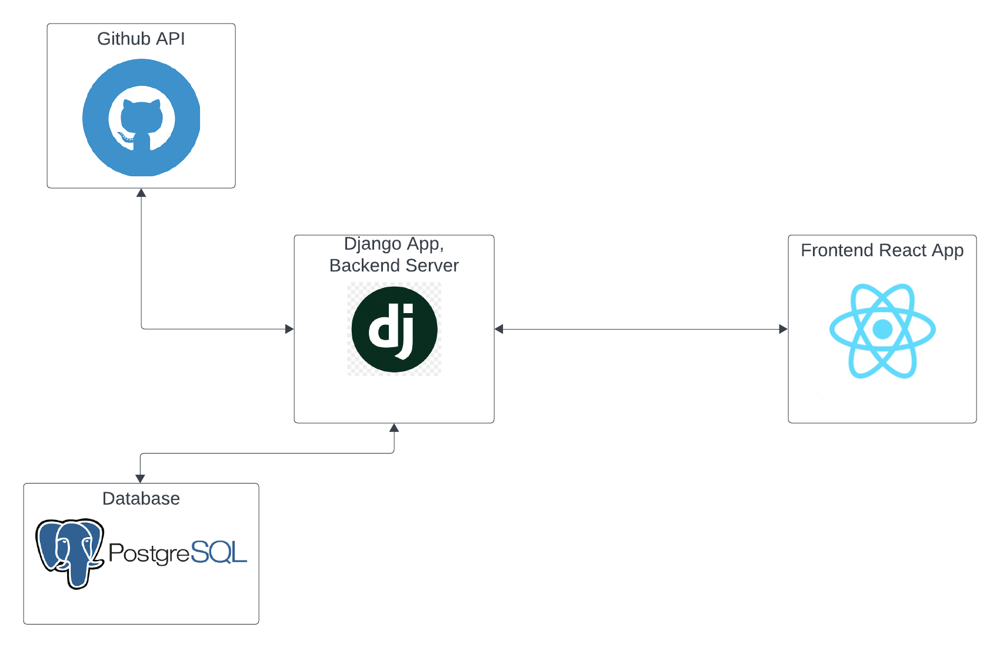

# Github Scraping Project

A full-stack project to get and store github repositories data in database and provide an appealing UI to display the data.


## 1. Installation

First clone the repository to your local machine. It has two directories: backend, and client.

```bash
# Database Setup: 
  # Make sure you have postgresql installed on your machine
  # Use a postgresql client (or a UI like PgAdmin) to create database: GithubScraper
```

```bash
# Backend Setup: 
  # Make sure you have postgresql, poetry (dependency management) on your machine.
  # Once you clone the repository:
  cd backend
  poetry install
  poetry shell

  # Create a .env file for database credentials and github API key (create a Github Personal Access Token )
  # .env file should have: DB_NAME, DB_HOST, DB_USER, DB_PASSWORD, DB_PORT, GITHUB_API_TOKEN

  python manage.py makemigrations
  python manage.py migrate

  python manage.py runserver
```

```bash
# Frontend Setup: 
  # Make sure you have node, npm installed on your machine.
  cd client
  npm install
  npm start

```

## 2. Description
The project aims to collect public github repositories of users and provide an intuitive UI to display required data. The project uses Github API to provide up-to-date information about users repositories.


## 3. Features

    1. User repositories page: Search for a Github username and get all their public repositories and  display Repository name, description, Number of stars and Number of forks. 
    2. Recent Users Page: Enter a number N and get N number of most recent users saved in the  database.
    3. Most Starred Projects: Enter a number N and get N number of most starred Project  (repositories) arranged in descending order.

## 4. Technologies Used
    1. Database -> PostgreSQL: As we need to store user and github repositories and perform complex queries on them efficiently, a SQL database is preferred. PostgreSQL is chosen as it provides ACID transactions, indexing, supports complex queries (joins), and offers scalability. As strong consistency and data integrity is important, a SQL database is preferred.

    2. Backend -> Poetry for Dependency management, Python Django REST Framework: Django is chosen for its rapid development features in building REST APIs. It comes with built-in ORM (simplifies database operations, Good for cloud-native), Database migrations, Authentication, serialization, and effective testing.

    3. Frontend -> React.js: React is chosen for its efficient component based architecture, allowing development of reusable UI components. It ensures seamless integration with REST APIs, provides responsive UI development, suitable for displaying Github data interactively.
## 5. Architecture


## 6. API Documentation
    1. 